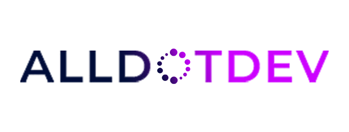

# Attendium V3

<p align="center">
  
</p>

<p align="center">
  <strong>Autonomous Enterprise Attendance Management System</strong><br>
  <em>Offline-First Desktop Attendance Database with Multimodal AI Vision Ingestion & Dynamic Roster Resolution</em>
</p>

<p align="center">
  <a href="#key-features">Key Features</a> •
  <a href="#system-architecture">Architecture</a> •
  <a href="#multi-model-ai-vision">AI Vision</a> •
  <a href="#getting-started">Getting Started</a> •
  <a href="#documentation">Documentation</a> •
  <a href="#customer-support">Support</a>
</p>

---

## Overview

**Attendium V3** is an offline-first desktop attendance management system engineered by **Alldotdev** for educators, university professors, academic departments, and institutional administrators. 

Built with Flutter Desktop for Windows, Attendium pairs an authoritative local SQLite database (WAL mode with strict foreign-key integrity) with a multi-model Vision AI extraction engine (Google Gemini, OpenAI GPT-4o, Anthropic Claude 3.5/3.7), deterministic fuzzy matching, a keyboard-first attendance grid, detailed student attendance timelines, and automated audit trails.

Attendium ensures educators can capture attendance from physical sign-in sheets, paper registers, whiteboard photos, spreadsheets, PDFs, or live classroom inputs—even completely offline—with 100% data ownership and privacy.

---

## Key Features

### 1. Offline-First Authoritative Database
- Runs completely standalone on Windows desktop with a zero-latency SQLite database.
- Uses Write-Ahead Logging (`WAL`) mode with full foreign key constraints and transactional integrity.
- Zero mandatory cloud dependency; local records are always authoritative.

### 2. Multi-Model Vision AI Ingestion Engine
- Supports leading frontier AI models with easy one-click switching:
  - **Google Gemini** (`gemini-2.5-flash`, `gemini-1.5-pro`)
  - **OpenAI** (`gpt-4o`, `gpt-4o-mini`)
  - **Anthropic Claude** (`claude-3-5-sonnet`, `claude-3-7-sonnet`)
  - **Deterministic Local Fallback Engine**
- Extracts student names, roll numbers, identifiers, and marked statuses from complex, curved, or hand-annotated sign-in sheets.
- Enforces strict JSON Schema contracts with automated JSON repair and confidence scoring.

### 3. Smart Multi-Format Student Roster Ingestion
- Ingest class rosters from multiple file formats:
  - **Spreadsheets**: Excel (`.xlsx`, `.xls`), CSV
  - **Documents**: PDF, Word / Text documents (`.txt`)
  - **Images**: High-resolution photos (`.png`, `.jpg`, `.jpeg`, `.webp`)
  - **Manual Paste / OCR Scanner**: Instant real-time parsing with live table preview and roll/name extraction.
- Create, edit, and delete classrooms, terms, and student records with full data consistency.

### 4. Interactive "Add to Roster" Prompt
- When an uploaded attendance sheet or scan contains students not currently enrolled in the classroom roster, Attendium automatically detects the discrepancy.
- Teachers receive an interactive prompt: *"Would you like to enroll this student into the classroom roster?"* allowing on-the-fly roster updates.

### 5. Keyboard-First Live Attendance Grid
- High-speed attendance entry during live lectures.
- Single-key instant status toggles:
  - `P` = Present
  - `A` = Absent
  - `L` = Late
  - `E` = Excused
  - `U` = Unmarked
- Arrow key navigation, multi-cell batch selection, and full undo/redo (`Ctrl+Z`, `Ctrl+Shift+Z`).

### 6. Full Duration Class Attendance & Student Timelines
- View comprehensive attendance matrices across the entire semester duration.
- Open the **Student Attendance History Dialog** to inspect any individual student's complete record, showing every session attended, missed, late, or excused with timestamped audit entries.

### 7. Deterministic Fuzzy Matching Engine
- Automatically correlates noisy extracted handwriting against existing rosters using composite multi-factor scoring:
  $$\text{FinalScore} = 0.40 \times \text{Roll} + 0.35 \times \text{Name} + 0.15 \times \text{Alias} + 0.10 \times \text{Context}$$
- Employs Levenshtein distance, Jaro-Winkler string similarity, name token reordering, and OCR digit confusion heuristics (`0`/`O`, `1`/`I`/`l`, `8`/`B`).

### 8. Enterprise Reporting & Audit Compliance
- **Excel Export**: Multi-sheet Microsoft Excel workbooks (`.xlsx`) with frozen headers, summary cards, session matrices, and statistics.
- **Academic PDF Reports**: Publication-quality PDF exports with institutional branding, percentage progress bars, and signature blocks.
- **Immutable Audit Trail**: Tracks who modified what attendance record, previous vs. new values, timestamps, and justification reasons.

### 9. Dedicated Alldotdev Customer Support Section
- Non-editable corporate support portal integrated directly within the application shell.
- Includes official Alldotdev branding, direct helpline (`03420554448`), support email (`alldotdev1@gmail.com`), operational hours, and system diagnostics.

---

## Technology Stack

| Layer | Technology |
|---|---|
| **Platform** | Flutter Desktop (Windows 10/11 64-bit, cross-platform ready) |
| **Language** | Dart 3.13+ |
| **Architecture** | Feature-First Clean Architecture (Domain, Infrastructure, Application, Presentation) |
| **State Management** | Flutter Riverpod |
| **Database** | SQLite 3 with Write-Ahead Logging (`WAL`) & Drift ORM |
| **AI Vision Models** | Google Gemini, OpenAI GPT-4o, Anthropic Claude 3.5/3.7 |
| **Document Processing** | Syncfusion Excel/PDF & native tabular parsing |
| **Security** | AES-256-GCM authenticated encryption for backups |

---

## Directory Structure

```
Attendium-V3/
├── assets/
│   └── images/               # Official brand assets and logos
├── docs/
│   ├── ARCHITECTURE.md       # Technical architecture specification
│   ├── DATABASE.md           # SQLite schema and indexing documentation
│   ├── AI_PIPELINE.md        # Multi-model vision pipeline & contracts
│   └── PROJECT_DOCUMENTATION.md # Complete project manual
├── lib/
│   ├── core/                 # Shared constants, logging, brand assets, error handling
│   ├── domain/               # Pure business logic, entities, value objects, interfaces
│   │   ├── entities/         # Classroom, Student, Session, AttendanceRecord, AuditLog
│   │   ├── enums/            # AttendanceStatus, MatchConfidenceBand, AuditAction
│   │   ├── repositories/     # Abstract repository interfaces
│   │   └── services/         # FuzzyMatcher, AttendanceCalculator, StudentNormalizer
│   ├── infrastructure/       # Database DAOs, AI Vision Providers, File Exporters
│   │   ├── ai/               # GeminiProvider, ClaudeProvider, OpenAIProvider
│   │   ├── database/         # AppDatabase, SQLite schemas, DAOs
│   │   ├── document/         # TabularParser, TextAttendanceParser
│   │   └── export/           # ExcelGenerator, PdfGenerator
│   └── presentation/         # Riverpod providers, screens, dialogs, widgets
│       ├── providers/        # StateNotifier and FutureProvider controllers
│       ├── screens/          # Dashboard, Classrooms, AttendanceGrid, Reports, Support
│       └── widgets/          # ImportRosterDialog, ScanAttendanceDialog, HistoryDialog
├── test/                     # Comprehensive unit, integration, and DAO test suite
└── pubspec.yaml              # Project manifest and dependencies
```

---

## Getting Started

### Prerequisites
- **Operating System**: Windows 10 or Windows 11 (64-bit)
- **Flutter SDK**: 3.47.0 or higher
- **Dart SDK**: 3.13.0 or higher
- **Visual Studio 2022**: With "Desktop development with C++" workload installed
- **API Keys (Optional)**: Google Gemini, Anthropic Claude, or OpenAI API key (for vision extraction features)

### Installation & Run

1. **Clone the Repository**:
   ```bash
   git clone https://github.com/Alldotdev/Attendium-V3.git
   cd Attendium-V3
   ```

2. **Fetch Dependencies**:
   ```bash
   flutter pub get
   ```

3. **Verify Code Analysis**:
   ```bash
   flutter analyze
   ```

4. **Run Unit & Integration Tests**:
   ```bash
   flutter test
   ```

5. **Launch Desktop Application**:
   ```bash
   flutter run -d windows
   ```

6. **Build Release Binary**:
   ```bash
   flutter build windows --release
   ```
   The executable is output to `build\windows\x64\runner\Release\attendium.exe`.

---

## Keyboard Shortcuts

| Shortcut | Action |
|---|---|
| `P` | Mark selected student(s) **Present** |
| `A` | Mark selected student(s) **Absent** |
| `L` | Mark selected student(s) **Late** |
| `E` | Mark selected student(s) **Excused** |
| `U` | Reset selected student(s) to **Unmarked** |
| `Arrow Keys` | Navigate active cell in attendance grid |
| `Ctrl + Z` | Undo last attendance change |
| `Ctrl + Shift + Z` | Redo attendance change |
| `Ctrl + S` | Save / commit session attendance |
| `Ctrl + F` | Search student in roster |

---

## Customer Support & Inquiries

Attendium is maintained and supported by **Alldotdev**.

- **Company**: Alldotdev
- **Helpline / Phone**: `03420554448` (`+92 342 0554448`)
- **Official Email**: [alldotdev1@gmail.com](mailto:alldotdev1@gmail.com)
- **Website**: [www.alldotdev.com](https://www.alldotdev.com)
- **Support Hours**: 
  - Monday – Friday: `9:00 AM – 6:00 PM PKT`
  - Saturday: `10:00 AM – 3:00 PM PKT`

---

## Detailed Project Documentation

For comprehensive technical architecture, database schemas, AI vision contracts, and operational guidelines, please refer to:
- 📖 [Full Project Technical Documentation](PROJECT_DOCUMENTATION.md)
- 🏛️ [Architecture Specification](ARCHITECTURE.md)
- 💾 [Database & Migrations Guide](DATABASE.md)
- 👁️ [AI Pipeline & Structured Schema](AI_PIPELINE.md)

---

## License

Copyright © 2026 Alldotdev. All rights reserved. Proprietary software for academic and institutional deployment.
